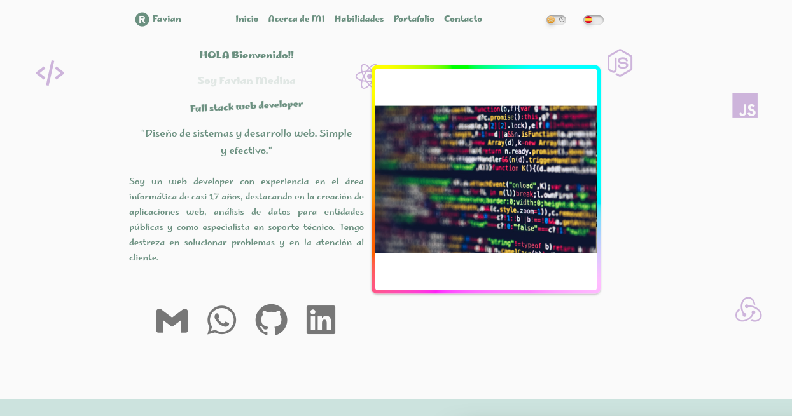

#  Aplicacion responsiva con html css y JS
## Aplicación web adaptable con modo oscuro/claro, multilingüe (inglés/español) y envío de correos. Personalizada con CSS (menús, tarjetas, galería).

### Descripcion

Este proyecto implementa mi Curriculm con frontend responsive (HTML, CSS, JavaScript), ofreciendo una interfaz intuitiva y adaptable a diferentes dispositivos. Incluye funcionalidades como modo oscuro, carga dinámica, soporte para múltiples idiomas y envío de formularios. Utiliza CSS personalizado para crear un diseño atractivo y coherente, y JavaScript para agregar interactividad y mejorar la experiencia del usuario, fuente google fonts, variables CSS, finalmente tiene validacion del formulario con mensajes de error para cada campo.
 

Puedes visitar la plataforma en línea en https://favian-medina-cv.vercel.app/

### Requisitos del Sistema

- **Sistema Operativo**: Ubuntu 22.04.4 LTS
- **Kernel**: Version 6.2.16-3-pve
- **NodeJS**:  20.17
- **npm/npx**: 10.8.4

Sistemas Alternativos Probados

El proyecto también ha sido probado en el siguiente entorno alternativo:

- **Sistema Operativo**: Windows 10 Pro 1803
- **NodeJS**:  18.20.4
- **npm/npx**: 18.20.4

## Comandos utiles
*Ver la versión del kernel:

uname -r

*Ver información del sistema:

sb_release -a

node -V

npm -v

npm install animate.css --save

https://animate.style/

https://boxicons.com/
